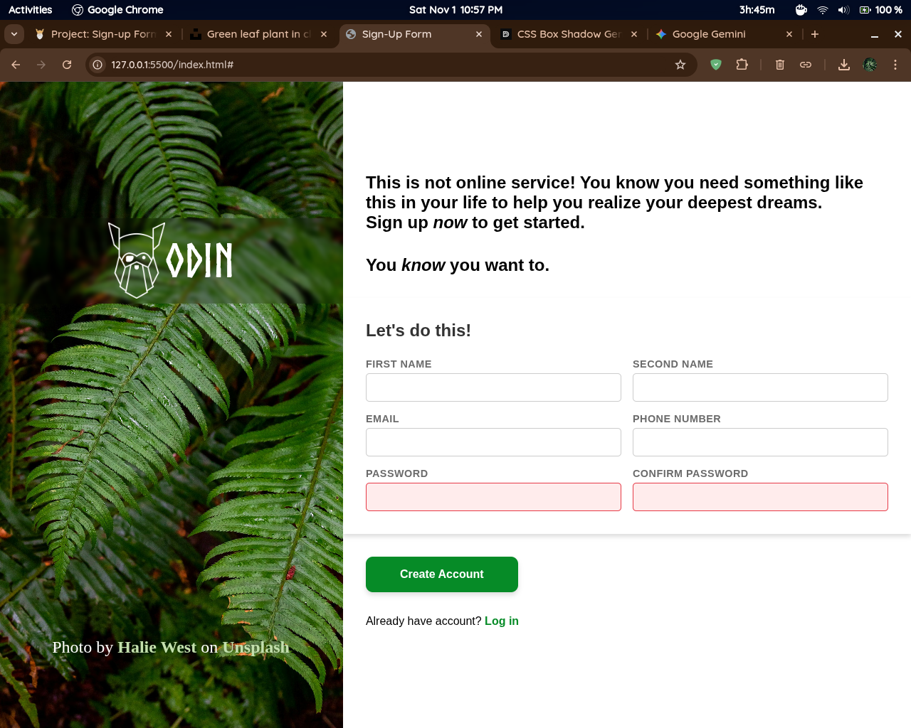

## ✍️ Project: ODIN Sign-Up Form

### 💡 Overview

This project is a classic sign-up form developed as an assignment for **The Odin Project's** curriculum. The primary focus of this build is to implement forms using HTML5 constraints.

The form layout is a modern, two-column design with a distinct background image on the left and the form fields on the right.

## 🛠️ Built With
+ HTML5 (Structure and form validation attributes)
+ CSS3 (Styling, layout, and visual feedback)

## 🔗 The Odin Project Assignment
This project was completed as part of the following lesson/module:
+ [https://www.theodinproject.com/lessons/node-path-intermediate-html-and-css-sign-up-form]
